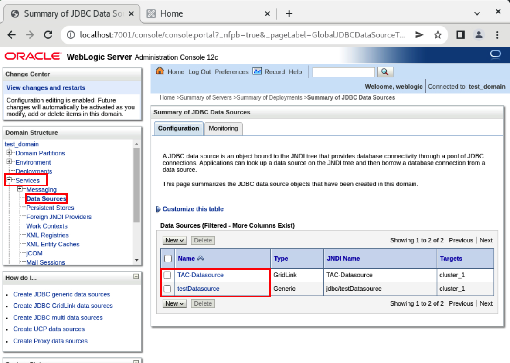
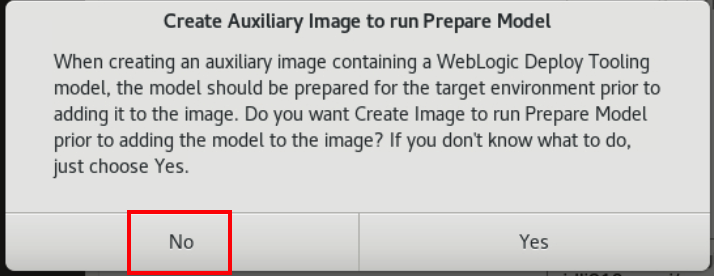
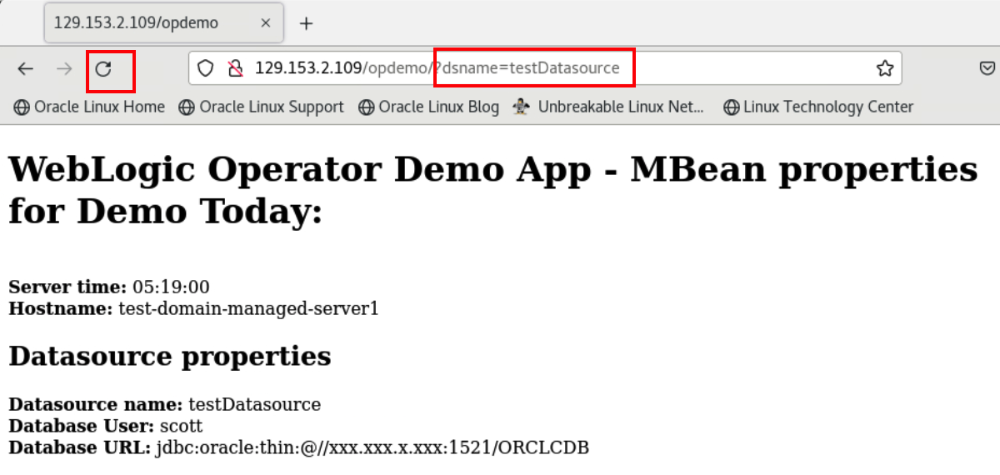
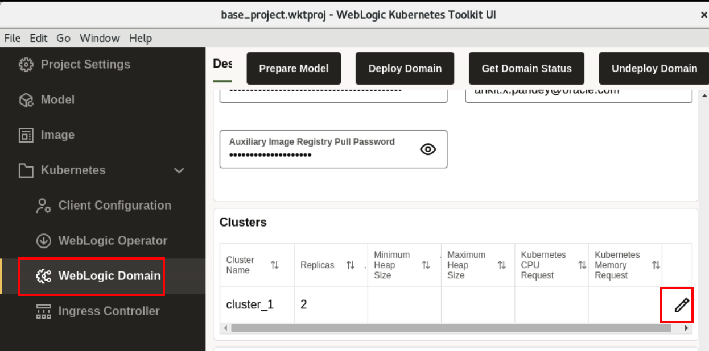

## Task 1: Prepare the Environment

### Collect details of the environment provided

1. In Luna Desktop, Click **Luna Lab**.

    


2. Create a text file outside of Luna to store details of the environment.

   Copy and paste the following field and save your text file.

    ```bash
    Luna Environment Details:

    User Name: 				
    Password: 				
    OCI Auth Token: 		
    OCI Region: 			
    Tenancy Name: 
    Compartment Name: 
    Region Endpoint:			
    Tenancy Namespace: 		
    Image Registry Username:  [TenancyNamespace/oracleidentitycloudservice/LunaUsername] 							
    Example: /oracleidentitycloudservice/
    Auxiliary Image Tag: 		[RegionEndpoint/TenancyNamespace/test-model-YourFirstName:v1]
    Example: //test-model-ankit:v1
    ```

    

    > From Luna, you will take these values and paste it in this text file.

03. In **Luna Lab** tab, Copy the values for **Username**, **Password** and **OCI Auth Token** and paste it in text file.

    

04. In **Oracle Cloud** tab, Copy the values for **OCI Region**, **Tenancy Name** and **Compartment Name** and paste it in text file.

    

    

05. Click **Luna Lab** and then **OCI Console** as shown.

    

06. Enter the **Username/Password** and then click **Sign In**.

    


### Create a repository inside Oracle Cloud Container Registry

1. In Cloud console, Click **Hamburger Menu** -> **Developer Services** -> **Container Registry**.

    

2. Select the correct compartment, and copy the **Namespace** to your text file. Click **Create repository**.

    


    > This is your tenancy namespace. You may face issue in creating repository. In that case, Under **Container & Artifacts**, first click **Kubernetes Cluster (OKE)** and then click **Container Registry**.

3. Enter **test-model-YourFirstName** as Repository name and select **Public** as `Access`, then click **Create repository**.

    

    > Please replace **YourFirstName** with your firstname and make repository name specific.


### Accept the license for WebLogic Server images 

We will use WebLogic Server 12.2.1.3.0 image as our Primary Image. So, to get access to WebLogic Server images, we accept the license agreement in Oracle Container Registry.

1. Copy and paste the link for the Oracle Container Registry [https://container-registry.oracle.com/](https://container-registry.oracle.com/) in browser and sign in. For this, you need an Oracle Account.

    
    
    > This is not your Luna username and password. 
    
2. Enter your **Oracle Account Credentials** in the Username and Password fields, and then click **Sign In**.

    

3. In the Home page of Oracle Container Registry, Search for **weblogic**.

    

4. Click **weblogic** as shown and select **English** as the language, then click **Continue**.

    

    

5. Click **Accept** to accept the license agreement.

    


### Prepare the text file

1. To find out the endpoint for your Region, copy and paste this URL [https://docs.oracle.com/en-us/iaas/Content/Registry/Concepts/registryprerequisites.htm#Availab](https://docs.oracle.com/en-us/iaas/Content/Registry/Concepts/registryprerequisites.htm#Availab) in browser. 

   In my case, it is **US East (Ashburn)** as the region name, thus its endpoint is **iad.ocir.io**. Find out your endpoint for your own **Region Name** and save it in your text file.

   

2. Now you have the values for **Tenancy namespace** and **Region Endpoint**, so create your own **Image Registry Username** and **Auxiliary Image Tag**.

    

    > Example are for your referency only. As in Luna, environment is temporary, so these data will not work.


### Open TigerVNC Viewer inside the Luna Environment.

1. In Cloud console, Click **Hamburger menu** -> **Compute** -> **Instances**.
 
    

2. Copy the **Public IP** for **weblogic** instance and paste it in text file.
 
    

3. Click **Applications** -> **Internet** -> **TigerVNC Viewer**.
 
    

4. Copy the following and replace **XX.XX.XX.XX** with your Public IP and then click on **Connect**.
 
    ```bash
    XX.XX.XX.XX::5901
    ``` 
    
    > If you don't see window for password, then please try after 1 minute.

5. Copy and paste the following password and then click on **OK**.

    ```bash
    LiveLabs.Rocks_99
    ```
    


You may continue to the next task.


<!-- 
************************************************************************************
************************************************************************************
************************************************************************************
************************************************************************************
************************************************************************************
-->


## Task 2: Modifying a WKT UI Project and Creation of Model file


### Start Admin Server and Explore on-premise domain

In this task, we start the Admin Server and navigate through the resources using WebLogic Administration console.

1. Click **Activities** and select the icon for **Terminal** as shown.

    

2. Copy and paste the following command to start the Admin Server.

    ```bash
    cd ~/Oracle/Middleware/Oracle_Home/user_projects/domains/test_domain/
    ./startWebLogic.sh
    ```

    

3. Click **Activities** \-\> **icon for Chrome browser** and copy and paste the following url:

    ```bash
    http://localhost:7001/console/login/LoginForm.jsp
    ```

    

    

4. Enter **weblogic/Welcome1%** as `Username/Password`, then click **Login**. You can see, we have WebLogic Server version **12.2.1.3.0**. 

    

5. To view available servers, expand **Environment** and click **Servers**. You can see, we have one dynamic clusters with 5 managed servers. 

    

6. To view the datasources, expand **Services** and click **Data Sources**.

    

7. To view the deployed application, click **Deployment**. You can see, we have **opdemo** as deployed application.

    


### Opening the base WKT UI Project

For simplicity of lab, we created **`base_project.wktproj`**, which preset the location of docker, Java and Oracle Home. In this task, we open  **`base_project.wktproj`** project.

1. Click **Activities** and then select the icon for **WebLogic Kubernetes Toolkit UI**.
    

2. Check the box for `stop showing this introduction at startup` and click **OK**.
    

3. To open **base_project.wktproj** project, click **File** -> **Open Project**. 
    

4. Select the **base_project.wktproj** inside the **Downloads** folder and then click **Open Project**.
    

5. Enter **welcome1** as password and then click **Unlock**.
    


### Introspection of an Offline on-premise domain 

In this task, we perform introspection of an on-premise domain, which creates a model file consist of domain configuration.

1. In WebLogic Kubernetes Toolkit UI, Click **File** -> **Add Model** -> **Discover Model(offline)**.

    

2. Click Open folder **icon** to open the **Domain Home**.

    

3. In the Home folder, navigate to **`/home/opc/Oracle/Middleware/Oracle_Home/user_projects/domains/`** directory and select **test-domain** folder then  click **Select**. Click **OK**.

    

    

    > If you look the console, you will see that this invokes WebLogic Deployer Tool to introspect the domain configuration in offline mode. 

5. Click **Model**, You can see the model.

    

    > The result of this WDT introspection are model(a metadata representation of your domain configuration), placeholder, where you can specify the values (like password for datasource) and application in the application archive.


### Validate and Prepare Model 

In this task, we validate the model and prepare the model to be deployed on Oracle Kubernetes Cluster (OKE).

1. To Validate the model, click **Validate Model**.

    

    > **For your information only:**<br>
    > Validate model invokes the WDT [Validate Model Tool](https://oracle.github.io/weblogic-deploy-tooling/userguide/tools/validate/), which validates that the model and its related artifacts  are well-formed and provides help on the valid attributes and subfolder for a particular model location.

2. Once you see **Validate Model Complete** window, click **Ok**.

    

3. To prepare the model, to be deployed on Kubernetes cluster, click **Prepare Model**

    

    > **For your information only:**<br>
    > Prepare model invokes the WDT [Prepare Model Tool](https://oracle.github.io/weblogic-deploy-tooling/userguide/tools/prepare/) to modify the model to work in a Kubernetes cluster with WebLogic Kubernetes Operator or Verrazzano installed.

4. Once you see **Prepare Model Complete** window,click **Ok**.

    


You may continue to the next task.


<!-- 
************************************************************************************
************************************************************************************
************************************************************************************
************************************************************************************
************************************************************************************
-->


## Task 3: Creation of Auxiliary Image and Pushing it in Oracle Container Image Registry

### Introduction

**Primary Image** - The image containing the Oracle Fusion Middleware software. It is used as the basis of all containers that run WebLogic Servers for the domain.

**Auxiliary Image** - The image that supplies the WebLogic Deploy Tooling software and the model files. At runtime, the auxiliary image’s content is merged with the primary image’s content.


In this task, We specify WebLogic server 12.2.1.3.0-ol8 image as Primary Image. Also, we create an auxiliary image, and push it to Oracle Container Image Registry repository using the generated authentication token. 

### Prepare Auxiliary Image and Push the Auxiliary Image 

In this task, We are creating an Auxiliary image, which we will push to the Oracle Cloud Container Registry.

1. Click **Image**. We already preset **Image Tag** with **container-registry.oracle.com/middleware/weblogic:12.2.1.3-ol8**. Click **Auxiliary Image**.

    
        
    > **For your information only:**<br>
    > The primary image is the one used for running the domain. One primary image can be reused for hundreds of domains. The primary image contains the OS, JDK, and FMW software installations.

2. In your text file, You already have **Auxiliary Image Tag**, **Image Registry Username** and **OCI Auth Token**. So paste these values in **Auxiliary Image Tag** , **Auxiliary Image Registry Push Username** and **Auxiliary Image Registry Push Password** respectively. Click **Create Auxiliary Image**.

    

    > For example in my case i have the following values:<br>
    > **Auxiliary Image Tag:** iad.ocir.io/idli319ngqxi/test-model-ankit:v1<br>
    > **Auixliary Image Registry Push Username:** idli319ngqxi /oracleidentitycloudservice/luna.user@64ae32bc-59c9-4d23-a7f1-e27febefde26<br>
    > **Auxiliary Image Registry Push Password:** #2CjkR#f7OERQ5R]zNw}<br>
    > These values are for reference only. As Luna environment is temporary, so these values will not work for you.

4. As we already prepared the model in Lab 2, so click on **No**.
    

5. Select **Downloads** folder where we want to save **WebLogic Deployer** and click **Select** as shown.
    

6. Once Auxiliary images is successfully created, On **Create Auxiliary Image Complete** window, click **Ok**. Click **Push Auxiliary Image** to push the image in repository inside your Oracle Cloud Container Image Registry.
    
    > **For your information only:**<br>
    >  An auxiliary image is domain-specific. The auxiliary image contains the data that defines the domain. 

7. Once image is successfully pushed, On **Push Image Complete** window, click **Ok**. 
    


You may continue to the next task.


<!-- 
************************************************************************************
************************************************************************************
************************************************************************************
************************************************************************************
************************************************************************************
-->


## Task 4: Deploy WebLogic Operator to Oracle Kubernetes Cluster (OKE)

Authenticate OCI CLI using the browser, which will creates **.oci/config** file. As we will use kubectl to manage the cluster remotely using the **Local Access**. 

It needs a **kubeconfig** file. This kubeconfig file will be generated using the OCI CLI. 

Then we verify the connectivity to Kubernetes cluster from the WebLogic Kubernetes Toolkit UI. At last, we install the WebLogic Kubernetes Operator to Kubernetes cluster(OKE).


### Configure kubectl (Kubernetes Cluster CLI) to connect to Oracle Kubernetes Cluster

Create the configuration file **.oci/config** and **.kube/config** in **/home/opc** directory. This configuration file allow us to access Oracle Kubernetes Cluster (OKE) from this virtual machine.

1. In chrome browser inside the TigerVNC Viewer, open the URL: [https://cloud.oracle.com/](https://cloud.oracle.com/). Enter your tenancy name as **Cloud Account Name**.
    

2. In Single Sign on page, Click **Continue**.
    

3. From text file, copy your luna username and password and paste here then click **Sign In**.
    

4. Click **User Icon** -> **User Settings**.    
    

5. Scroll down, Click **API Keys** and then click **Add API Key**.
    

6. Select **Generate API Key Pair** and then Click **Download Private Key**, **Download Public Key** and **Add** as shown.
    

7. Click **Copy** and Paste the content of this in text file.
    

8. Click **Activities** and select Terminal, then click **File** -> **New Tab**. 
    

9. Find out the location of Private key and paste it in your text file.
    
    > In terminal, type /home/opc/Downloads/oracle and then use tab key to get the complete file name. It is **.pem** file.

10. Copy and paste the following command in your new tab as shown.
    
    ```bash
    mkdir .oci
    vi ~/.oci/config
    ```

    

11. In your text file, fill the value of **key_file** with location of private key and then copy the content and paste it in **.oci/config** file as shown.
   

12. Copy and paste the following command to change the permission of **oci/config** and **private key** file

    ```bash
    chmod 600 .oci/config ~/Downloads/<your_private_key_name>
    ```

    

13. In Cloud console, Click **Hamburger menu** -> **Developer Services** -> **Kubernetes Clusters (OKE)**.
    

14. Select the correct compartment name and then click **cluster1**. 
    

15. Click **Access Cluster**.
    

16. Select **Local Access** and Copy the **VCN-Native Public endpoint** as shown.
    

17. Paste this command in terminal as shown.
    

    > It creates the **.kube/config** file.


### Verify Connectivity of WebLogic Kubernetes Toolkit UI to Oracle Kubernetes Cluster

In this task, we verify the connectivity to **Oracle Kubernetes Cluster(OKE)** from the `WebLogic Kubernetes Toolkit UI` application.

1. Go back to WebLogic Kubernetes Tool Kit UI, click  **Kubernetes** ->  **Client Configuration** and then click **Verify Connectivity**.
    

2. Once you see **Verify Kubernetes Client Connectivity Success** window, Click **Ok**.
    


### Install the WebLogic Kubernetes Operator to Oracle Kubernetes Cluster

This section provides support for installing the WebLogic Kubernetes Operator (the “operator”) in the target Kubernetes cluster. 

1. Click **WebLogic Operator**. Specify the following configuration details  and click **Install Operator**.

    **Kubernetes Namespace** - The Kubernetes namespace to which to install the operator. Leave the default value.

    **Kubernetes Service Account** - The Kubernetes service account for the operator to use when making Kubernetes API requests. Leave the default value.

    **Helm Release Name to Use for Operator Installation** - The Helm release name to use to identify this installation. Leave the default value.

     
    
2. Once you see **WebLogic Kubernetes Operator Installation Complete**, Click **Ok**.
    


You may continue to the next task.


<!-- 
************************************************************************************
************************************************************************************
************************************************************************************
************************************************************************************
************************************************************************************
-->

## Task 5: Deploy WebLogic Domain to Oracle Kubernetes Cluster (OKE)

Deploy the Kubernetes custom resource for the WebLogic domain to Kubernetes Cluster.

1. Scroll down, enter the following in Primary Image section, Enter  Oracle account username and password in **Image Registry Pull Username** and **Image Registry Pull Password** respectively. Enter your Oracle email id in **Image Registry Pull Email Address**. 

   These are the same credential which you used to accept license for **weblogic** images in Oracle Container Registry.

   

   > **For your information only:**<br>
   > We are pulling the image from the Oracle Container Registry, so we are specifying the credential, which we used to accept the license agreement for WebLogic Server Images.


3. Scroll down, enter the following in Auxiliary Image section, from text file copy and paste **Image Registry Username** and **OCI Auth Token** in **Image Registry Pull Username** and **Image Registry Pull Password** respectively. Enter your Cloud email id in **Image Registry Pull Email Address**. These are the same credential which you used to push Auxiliary images in Oracle Cloud Container Image Registry.
    

4.  In **Clusters** section, click on **Edit** icon as shown.
    

5. Enter **2** as **Replicas** and then Click **OK**. The size of replica decides the number of managed server in the **Running** state after successfull deployment of WebLogic Domain to Kubernetes cluster.
    

6. In Datasources section, double click to edit **passwords** for two datasource. You can give **tiger** as password in both the datasources. Once done, click **Deploy Domain**.
    
    > This deploy WebLogic Domain test-domain to Kubernetes namespace **test-domain-ns**.

7. Once you see **WebLogic Domain Deployment to Kubernetes Complete** window, Click **OK**.
    

8. Go back to terminal, Click **Activities** and select the **Terminal** window. Copy the following command and paste it terminal. You should see the similar output, where pod for introspector run first then for the Admin Server and later pods for managed server goes in the **Running** state.

    ````bash
    kubectl get pods -n test-domain-ns -w
    ````

    
    > Leave this command to run as it is. we will monitor output of it.

9. You can also get the domain status through **WebLogic Kubernetes Toolkit UI**. Go back to **WebLogic Kubernetes Toolkit UI** and click **Get Domain Status**. In Domain Status window, Scroll down to see status of all server pods then click **OK**.
    


You may continue to the next task.


<!-- 
************************************************************************************
************************************************************************************
************************************************************************************
************************************************************************************
************************************************************************************
-->
## Task 6: Deploy Ingress Controller to Oracle Kubernetes Cluster (OKE)

In this task, we install the **Traefik** Ingress Controller. Later, we updates the **Ingress Routes** to access the application and admin server.


### Installtion of Ingress Controller to the Oracle Kubernetes Cluster

1. Install the **Ingress Controller**.

   Click **Ingress Controller**. You can see some pre-filled values, leave it default and click **Install Ingress Controller**.
    
    > **For your information only:**<br>
    > This successfully install the **traefik-operator** ingress controller to Kubernetes namespace **traefik-ns**. 

2. Once you see **Ingress Controller Installation Complete**, click **Ok**.
    


### Update the Ingress Routes to Access the Application

1. Scroll down and click on **+** icone to add the **Ingress Route Configuration**. Click on Edit icon as shown to modify the values.
    

2. Enter the following details and click on **OK**.<br>
        Name: console<br> 
        Path Expression: /console<br>
        Target Service Namespace: test-domain-ns<br>
        Target Service: test-domain-admin-server<br>
        Target Port: 7001<br>

    

3. In the similar way, add the following **opdemo** ingress routes as well:<br>
        Name: opdemo<br>
        Path Expression: /opdemo<br>
        Target Service Namespace: test-domain-ns<br>
        Target Service: test-domain-cluster-cluster-1 <br>
        Target Port: 8001<br>
    

4. In the similar way, add the following **remote-console** ingress routes as well:<br>
        Name: remote-console<br>
        Path Expression: / <br>
        Target Service Namespace: test-domain-ns<br>
        Target Service: test-domain-admin-server<br>
        Target Port: 7001<br>
        

5. To update the Inress Routes, click **Update Ingress Routes**.
    

6. On **Update Existing Ingress Routes** window, click **Yes**.
    

7. Once you see **Ingress Routes Update Complete** window, Click **Ok**.
    


You may continue to the next task.


<!-- 
************************************************************************************
************************************************************************************
************************************************************************************
************************************************************************************
************************************************************************************
-->
## Task 7: Testing Application Deployment

Access the application **opdemo** and verify the successful migration of an offline on-premise domain. 

we also verify the loadbalancing between managed server pods. Later, we use WebLogic Remote Console, to verify the successful deployment of resources of test-domain in kubernetes environment.


### About WebLogic Remote Console

The WebLogic Remote Console is a lightweight, open source console that you can use to manage your WebLogic Server domain running anywhere, such as on a physical or virtual machine, in a container, Kubernetes, or in the Oracle Cloud. The WebLogic Remote Console does not need to be colocated with the WebLogic Server domain.

You can install and run the WebLogic Remote Console anywhere, and connect to your domain using WebLogic REST APIs. You simply launch the desktop application and connect to the Administration Server of your domain. Or, you can start the console server, launch the console in a browser and then connect to the Administration Server.

The WebLogic Remote Console is fully supported with WebLogic Server 12.2.1.3, 12.2.1.4, and 14.1.1.0.

**Key Features of the WebLogic Remote Console**

* Configure WebLogic Server instances and clusters
* Create or modify WDT metadata models
* Configure WebLogic Server services, such as database connectivity (JDBC), and messaging (JMS)
* Deploy and undeploy applications
* Start and stop servers and applications
* Monitor server and application performance


### Access the Application through the Browser

1. Access the **opdemo** application. We click on refresh icon to make multiple request to application, to verify loadbalancing between two managed server pods.

   Click the URL for **opdemo**.
    


2. Append **?dsname=testDatasource** as shown below.If you click on Refresh icon, You can see load balancing between two managed server pods.
    ```bash
    ?dsname=testDatasource
    ```
    

    

    > Please copy the IP and paste it in text file. Leave this page open, we will use it later.


### Explore WebLogic Domain on Kubernetes Cluster using WebLogic Remote Console

1. Explore the WebLogic Remote Console. 

   We create connection to **Admin Server** in Remote Console and verify the resources in WebLogic Domain. This verifies the successful migration of an on-premise domain into the Oracle Kubernetes Cluster. 

   To open WebLogic Remote Console, Click on **Activities**, then select the **WebLogic Remote Console** Icon.
    

2. Click on `Three dots` under **Kiosk** and then click **Add Admin Server Connection Provider**.
    

3. Enter the following data and click **OK**.<br>
    Connection Provider Name: KubernetesEnv<br>
    Username: weblogic<br>
    Password: welcome1<br>
    URL:  `Copy_IP_From_TextFile`</br>
    

4. Click on **Edit Tree** icon, then Select **Deployments** -> **App Deployments**. You can observe the same **opdemo** application, which we had seen in on-premise domain.
    

5. Click on **Edit Tree** icon, then Select **Services** -> **JDBC System Resources**. You can observe the same Datasouce, which we had seen in on-premise domain.
    

6. Click on **Monitoring Tree** Icon as shown then select **Running Servers**. You can see we have **Admin Server** and 2 Managed Server pods are running. Click on **admin-server**, you can see WebLogic Versin is **12.2.1.3.0**.
    
    > Leave this page open in WebLogic Remote Console.
    

Congratulation !!!


**This is the end of the lab.**


**We hope you have found this lab useful.**


We encourage you to try other AppDev labs in Luna. Search for the keyword **appdev**, will provide you all the application development related labs in this product pillar. 


To exit, click the **End Session** icon on the Luna tool bar. 


***


<!-- 
************************************************************************************
************************************************************************************
************************************************************************************
************************************************************************************
************************************************************************************
-->


## (Optional) Task 8: Scaling a WebLogic Cluster

1. Modify the **Replica** value from 2 to 3 and re-deploy the domain again. 

   Go back to WebLogic Kubernetes Toolkit UI,  Click **WebLogic Domain**. Go to **Clusters** section and click on **Edit** icon.  

    

2. Change the Replicas from **2** to **3**, and click **OK**. 
    

3. To Re-deploy the domain, click **Deploy Domain**. Once you see **WebLogic Domain Deployment to Kubernetes Complete** window, click **Ok**.
    

4. Go back to **Terminal** window, Click **Activities** and select the **Terminal** window. 

    
    > You can see, re-deployment of domain, starts the process of creating pod for test-domain-managed-server3 and in sometime, this pod gets into **Running** status.

5. Go back to Firefox, where you have the application page open. Click **Refresh** button, you will see the load balancing between three managed server now.
    

6. Go back to WebLogic Remote Console, click on **Monitoring Tree** -> **Running Servers**. You will notice **managed-server3** here also.
    

<!-- 
************************************************************************************
************************************************************************************
************************************************************************************
************************************************************************************
************************************************************************************
-->


## (Optional) Task 9: Making a upgrade in WebLogic Server Version 

To modify the primary image, we use WebLogic Server Image with **12.2.1.4-slim-ol8** tag. Then we re-deploy the domain using WebLogic Kubernetes Toolkit UI. At last, we verify that newly managed server pods are using the updated WebLogic Server images through WebLogic Remote Console.

1. Update the primary image to use upgraded WebLogic Server 12.2.1.4.0 image.

   Go back to WebLogic Kubernetes Toolkit UI, click **Image**. Changed the WebLogic Server Tag to **12.2.1.4-slim-ol8**.
    


1. Update a deployed application by a rolling restart of the server pods

   Click **WebLogic Domain** -> **Deploy Domain**. This will re-deploy the domain.
    

    > **For your information only:**<br>
    > As we changed our primary image, so we will notice rolling restart of the servers one by one. As you click on **Deploy Domain**, it start an **Introspector job**, which terminates the running admin server pods, and creates a new pod for admin server which uses WebLogic Server 12.2.1.4.0 image. Introspector do the same process with both the managed servers.

2. Once you see **WebLogic Domain Deployment to Kubernetes Complete** window, Click **Ok**.

3. Go back to **Terminal** and copy the below command and paste in terminal. You will notice rolling restart of servers one by one. First, Admin Server pods terminates and comes in **Running** state.
    
    ```bash
    kubectl get pods -n test-domain-ns -w
    ```
    

4. To Verify that Admin Server and Managed Server pods are using updated WebLogic Server image, click **Monitoring Tree** icon and then select **Running Servers** -> **admin-server**. You can see, it is using **12.2.1.4.0**.
    

<!-- 
************************************************************************************
************************************************************************************
************************************************************************************
************************************************************************************
************************************************************************************
-->
