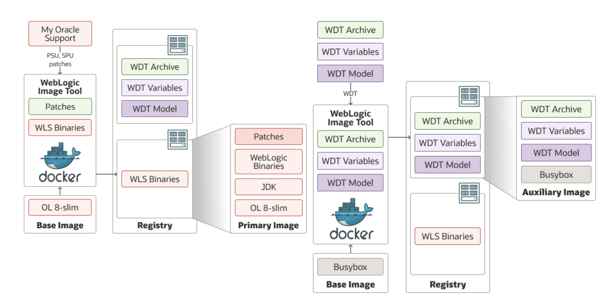
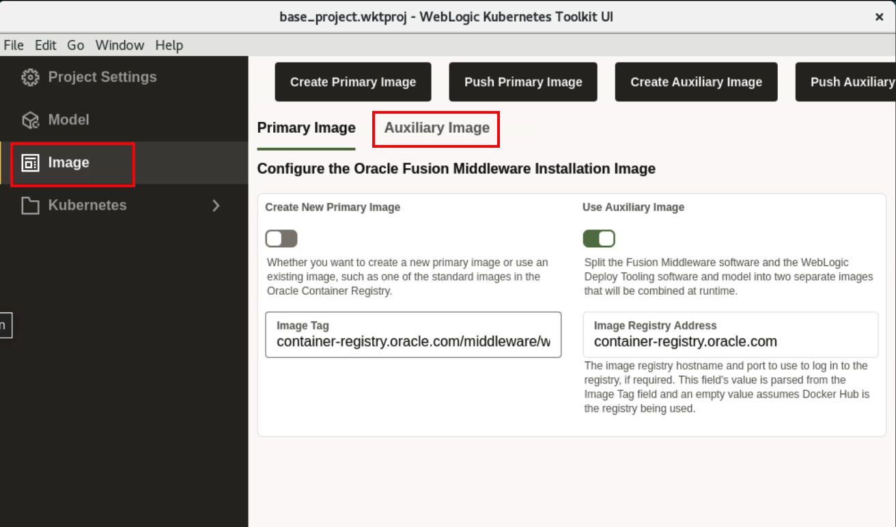
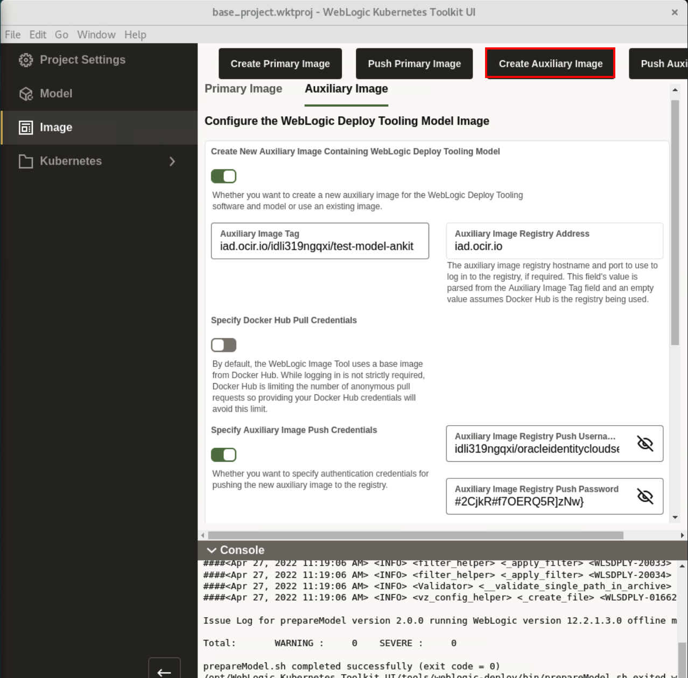
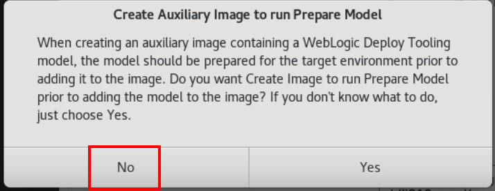
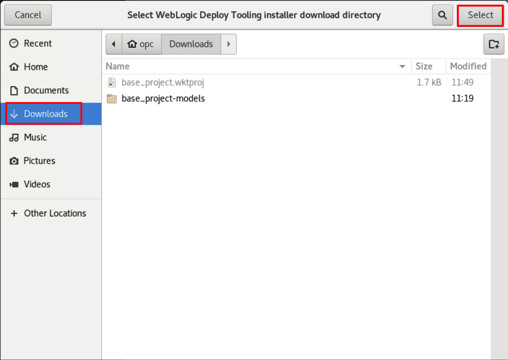
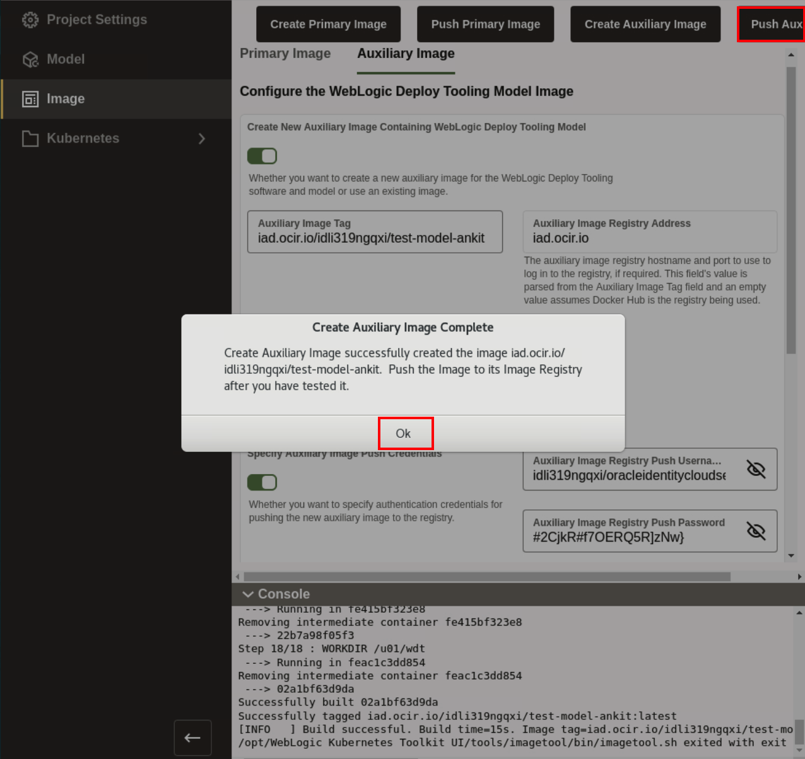
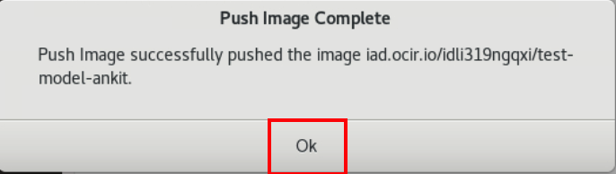

# Creation of Images for the Oracle Container Engine for Kubernetes (OKE) on Oracle Cloud Infrastructure (OCI)
## Introduction

**Primary Image** - The image containing the Oracle Fusion Middleware software. It is used as the basis of all containers that run WebLogic Servers for the domain.

**Auxiliary Image** - The image that supplies the WebLogic Deploy Tooling software and the model files. At runtime, the auxiliary image’s content is merged with the primary image’s content.
    

In this Lab, We specify WebLogic server 12.2.1.3.0-ol8 image as Primary Image. Also, we create an auxiliary image, and push it to Oracle Container Image Registry repository using the generated authentication token. 

### Objectives

In this lab, you will:

* Create an Auxiliary Image and push the image to Oracle Cloud Container Image Registry.

### Prerequisites

* You should have a text editor.

## Task 1: Prepare Auxiliary Image and Push the Auxiliary Image 

In this task, We are creating an Auxiliary image, which we will push to the Oracle Cloud Container Registry.

1. Click *Image*. We already preset *Image Tag* with *container-registry.oracle.com/middleware/weblogic:12.2.1.3-ol8*. Click *Auxiliary Image*.
    
        
    > **For your information only:** 
    > The primary image is the one used for running the domain. One primary image can be reused for hundreds of domains. The primary image contains the OS, JDK, and FMW software installations.

2. In your text file, You already have *Auxiliary Image Tag*, *Image Registry Username* and *OCI Auth Token*. So paste these values in *Auxiliary Image Tag* , *Auixliary Image Registry Push Username* and *Auxiliary Image Registry Push Password* respectively. Click *Create Auxiliary Image*.
    
    > For example in my case i have the following values: 
    > **Auxiliary Image Tag:** iad.ocir.io/idli319ngqxi/test-model-ankit:v1 
    > **Auixliary Image Registry Push Username:** idli319ngqxi /oracleidentitycloudservice/luna.user@64ae32bc-59c9-4d23-a7f1-e27febefde26 
    > **Auxiliary Image Registry Push Password:** #2CjkR#f7OERQ5R]zNw} 
    > These values are for reference only. As Luna environment is temporary, so these values will not work for you.

4. As we already prepared the model in Lab 2, so click on *No*.
    

5. Select *Downloads* folder where we want to save *WebLogic Deployer* and click *Select* as shown.
    

6. Once Auxiliary images is successfully created, On *Create Auxiliary Image Complete* window, click *Ok*. Click *Push Auxiliary Image* to push the image in repository inside your Oracle Cloud Container Image Registry.
    
    > **For your information only:** 
    >  An auxiliary image is domain-specific. The auxiliary image contains the data that defines the domain. 

7. Once image is successfully pushed, On *Push Image Complete* window, click *Ok*. 
    

## Acknowledgements

* **Author** -  Ankit Pandey
* **Contributors** - Maciej Gruszka, Sid Joshi
* **Last Updated By/Date** - Kamryn Vinson, March 2022