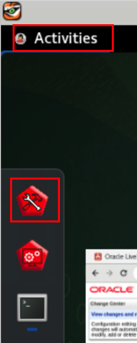

# Creation of Model for the Oracle Container Engine for Kubernetes (OKE) on Oracle Cloud Infrastructure (OCI)
## Introduction

In this lab, we explore the on-premise WebLogic domain. We navigate through the administration console to view the deployed application, datasources and servers in *test-domain*. we also open the pre-created *`base_project.wktproj`*, which already have pre-filled values for *Project Settings* section. Then we create the model file, by introspecting of an offline on-premise domain. At last, we validate the model and prepare the model to be deployed on Oracle Kubernetes Cluster (OKE).

### Objectives

In this lab, you will:

* Explore the on-premise WebLogic domain *test-domain*.
* Open the base WKT project.
* Introspection of an offline on-premise domain.
* Validate and prepare model. 

### Prerequisites

* You must have Text Editor.
* Chrome or Firefox browser.

## Task 1:  Start Admin Server and Explore on-premise domain

In this task, we start the Admin Server and navigate through the resources using WebLogic Administration console.

1. Click *Activities* and select the icon for *Terminal* as shown.
        

2. Copy and paste the following command to start the Admin Server.
        ```bash
        <copy>cd ~/Oracle/Middleware/Oracle_Home/user_projects/domains/test_domain/
        ./startWebLogic.sh</copy>
        ```
        

3. Click *Activities* -> *icon for Chrome browser* and copy and paste the following url:
        ```bash
        <copy>http://localhost:7001/console/login/LoginForm.jsp</copy>
        ```
        
        

4. Enter *weblogic/Welcome1%* as `Username/Password`, then click *Login*. You can see, we have WebLogic Server version *12.2.1.3.0*.   
    

5. To view available servers, expand *Environment* and click *Servers*. You can see, we have one dynamic clusters with 5 managed servers. 
    

6. To view the datasources, expand *Services* and click *Data Sources*.
    

7. To view the deployed application, click *Deployment*. You can see, we have *opdemo* as deployed application.
    

## Task 2: Opening the base WKT UI Project

For simplicity of lab, we created *`base_project.wktproj`*, which preset the location of docker, Java and Oracle Home. In this task, we open  *`base_project.wktproj`* project.

1. Click *Activities* and then select the icon for *WebLogic Kubernetes Toolkit UI*.
    

2. Check the box for `stop showing this introduction at startup` and click *OK*.
    

3. To open *base_project.wktproj* project, click *File* -> *Open Project*. 
    

4. Select the *base_project.wktproj* inside the *Downloads* folder and then click *Open Project*.
    

5. Enter *welcome1* as password and then click *Unlock*.
    

## Task 3: Introspection of an Offline on-premise domain 

In this task, we perform introspection of an on-premise domain, which creates a model file consist of domain configuration.

1. In WebLogic Kubernetes Toolkit UI, Click *File* -> *Add Model* -> *Discover Model(offline)*..
    

2. Click Open folder *icon* to open the *Domain Home*.
    

3. In the Home folder, navigate to *`/home/opc/Oracle/Middleware/Oracle_Home/user_projects/domains/`* directory and select *test-domain* folder then  click *Select*. Click *OK*.
    
    

    > If you look the console, you will see that this invokes WebLogic Deployer Tool to introspect the domain configuration in offline mode. 

5. Click *Model*, You can see the model.
    

    > The result of this WDT introspection are model(a metadata representation of your domain configuration), placeholder, where you can specify the values (like password for datasource) and application in the application archive.

## Task 4: Validate and Prepare Model 

In this task, we validate the model and prepare the model to be deployed on Oracle Kubernetes Cluster (OKE).

1. To Validate the model, click *Validate Model*.
    
    > **For your information only:**<br>
    > Validate model invokes the WDT [Validate Model Tool](https://oracle.github.io/weblogic-deploy-tooling/userguide/tools/validate/), which validates that the model and its related artifacts  are well-formed and provides help on the valid attributes and subfolder for a particular model location.

2. Once you see *Validate Model Complete* window, click *Ok*.
    

3. To prepare the model, to be deployed on Kubernetes cluster, click *Prepare Model*
    
    > **For your information only:**<br>
    > Prepare model invokes the WDT [Prepare Model Tool](https://oracle.github.io/weblogic-deploy-tooling/userguide/tools/prepare/) to modify the model to work in a Kubernetes cluster with WebLogic Kubernetes Operator or Verrazzano installed.

4. Once you see *Prepare Model Complete* window,click *Ok*.
    


## Acknowledgements

* **Author** -  Ankit Pandey
* **Contributors** - Maciej Gruszka, Sid Joshi
* **Last Updated By/Date** - Kamryn Vinson, March 2022