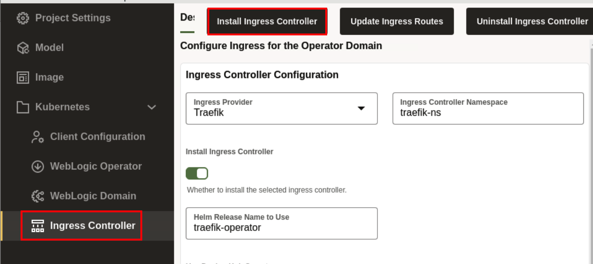
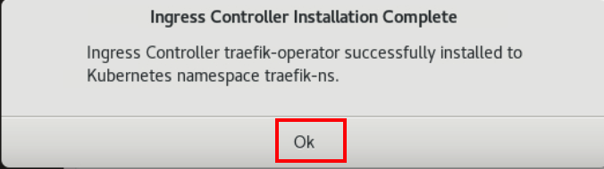
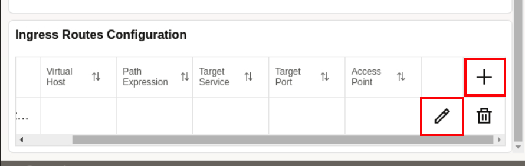
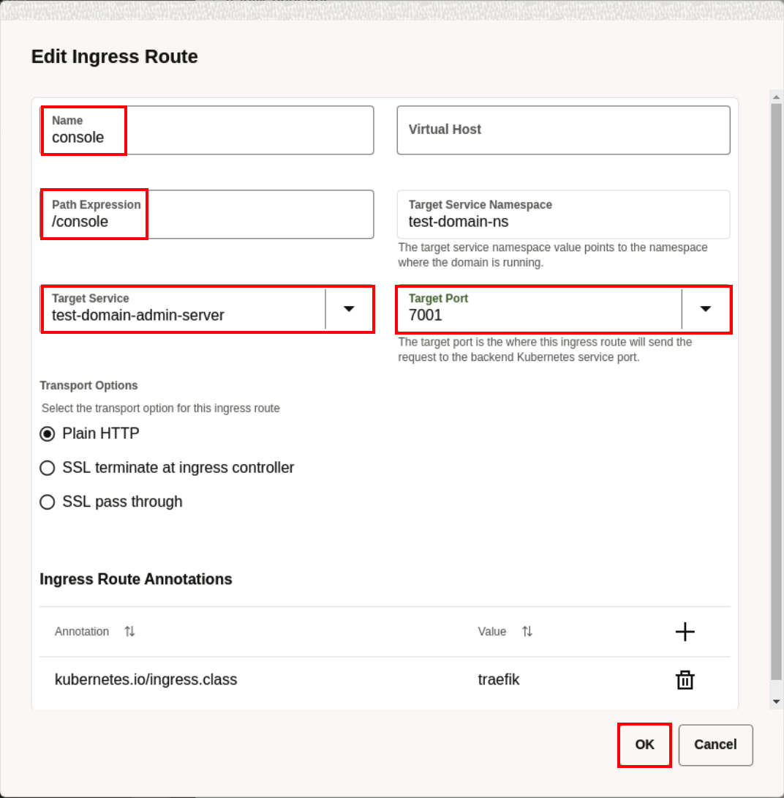
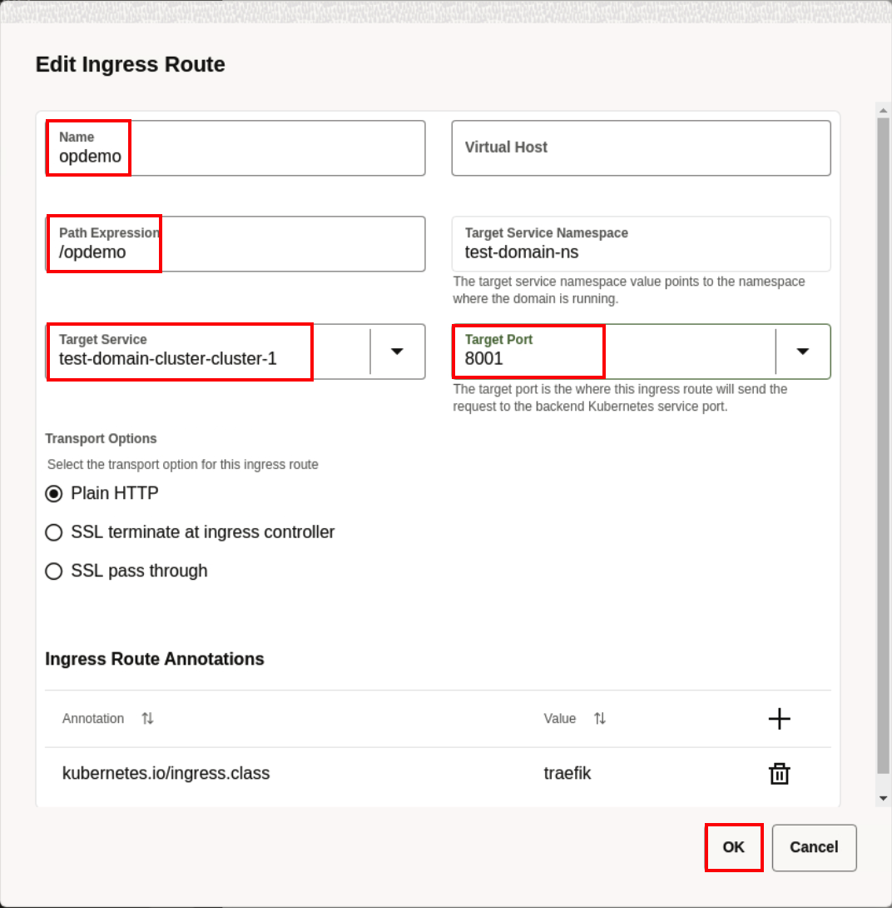
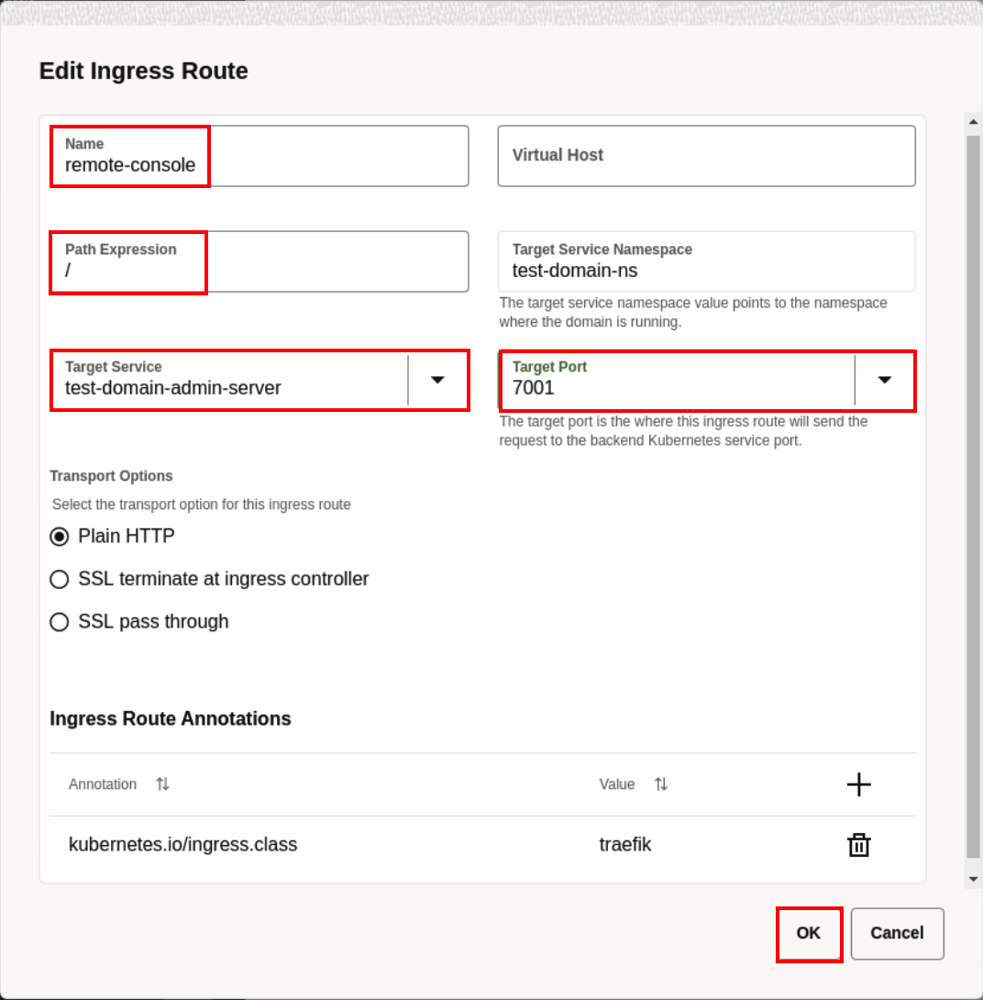
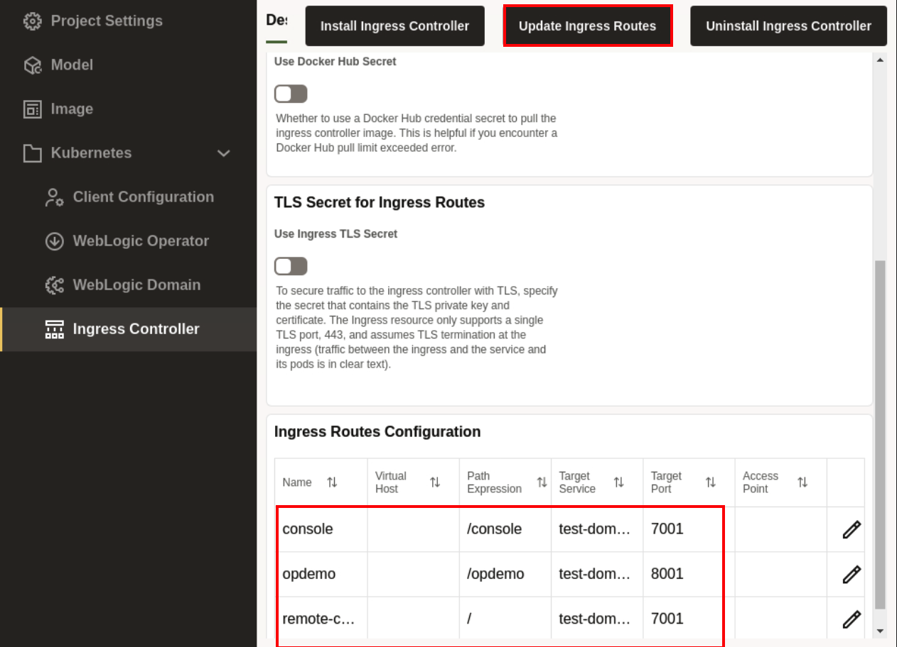
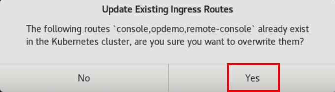
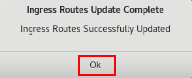

# Deployment of Ingress Controller to the Oracle Container Engine for Kubernetes (OKE) on Oracle Cloud Infrastructure (OCI) From WebLogic Kubernetes Toolkit UI

## Introduction

In this lab, we install the *Traefik* Ingress Controller. Later, we updates the *Ingress Routes* to access the application and admin server.

### Objectives

In this lab, you will:

* Install Ingress Controller on Kubernetes Cluster.
* Update the Ingress Routes.

### Prerequisites

* You must have Text editor.

## Task 1: Installtion of Ingress Controller to the Oracle Kubernetes Cluster

In this task, we install the *Ingress Controller*.

1. Click *Ingress Controller*. You can see some pre-filled values, leave it default and click *Install Ingress Controller*.
    
    > **For your information only:** 
    > This successfully install the *traefik-operator* ingress controller to Kubernetes namespace *traefik-ns*. 

2. Once you see *Ingress Controller Installation Complete*, click *Ok*.
    

## Task 2: Update the Ingress Routes to Access the Application

In this task, we add the Ingress routes for Accessing the Admin Console, Application. At the end, we get the accessible endpoints.

1. Scroll down and click on *+* icone to add the *Ingress Route Configuration*. Click on Edit icon as shown to modify the values.
    

2. Enter the following details and click on *OK*. 
        Name: console  
        Path Expression: /console 
        Target Service Namespace: test-domain-ns 
        Target Service: test-domain-admin-server 
        Target Port: 7001 

    

3. In the similar way, add the following *opdemo* ingress routes as well: 
        Name: opdemo 
        Path Expression: /opdemo 
        Target Service Namespace: test-domain-ns 
        Target Service: test-domain-cluster-cluster-1  
        Target Port: 8001 
    

4. In the similar way, add the following *remote-console* ingress routes as well: 
        Name: remote-console 
        Path Expression: /  
        Target Service Namespace: test-domain-ns 
        Target Service: test-domain-admin-server 
        Target Port: 7001 
        

5. To update the Inress Routes, click *Update Ingress Routes*.
    

6. On *Update Existing Ingress Routes* window, click *Yes*.
    

7. Once you see *Ingress Routes Update Complete* window, Click *Ok*.
    

## Acknowledgements

* **Author** -  Ankit Pandey
* **Contributors** - Maciej Gruszka, Sid Joshi
* **Last Updated By/Date** - Kamryn Vinson, March 2022