# Deployment of WebLogic Kubernetes Operator to the Oracle Container Engine for Kubernetes (OKE) on Oracle Cloud Infrastructure (OCI) From WebLogic Kubernetes Toolkit UI

## Introduction

In this lab, we authenticate OCI CLI using the browser, which will creates *.oci/config* file. As we will use kubectl to manage the cluster remotely using the *Local Access*. It needs a *kubeconfig* file. This kubeconfig file will be generated using the OCI CLI. Then we verify the connectivity to Kubernetes cluster from the WebLogic Kubernetes Toolkit UI. At last, we install the WebLogic Kubernetes Operator to Kubernetes cluster(OKE).

### Objectives

In this lab, you will:

* Configure kubectl (Kubernetes Cluster CLI) to connect to Kubernetes Cluster.
* Verify Connectivity of WebLogic Kubernetes Toolkit UI to Kubernetes Cluster.
* Install the WebLogic Kubernetes Operator to Kubernetes Cluster.


### Prerequisites

* Access to noVNC Remote Desktop created in lab 1.
* You should have a text editor.

## Task 1: Configure kubectl (Kubernetes Cluster CLI) to connect to Oracle Kubernetes Cluster
In this Task, we creats the configuration file *.oci/config* and *.kube/config* in */home/opc* directory. This configuration file allow us to access Oracle Kubernetes Cluster (OKE) from this virtual machine.

1. In chrome browser inside the noVNC remote desktop, open the URL: [https://cloud.oracle.com/](https://cloud.oracle.com/). Enter your tenancy name as *Cloud Account Name*.
    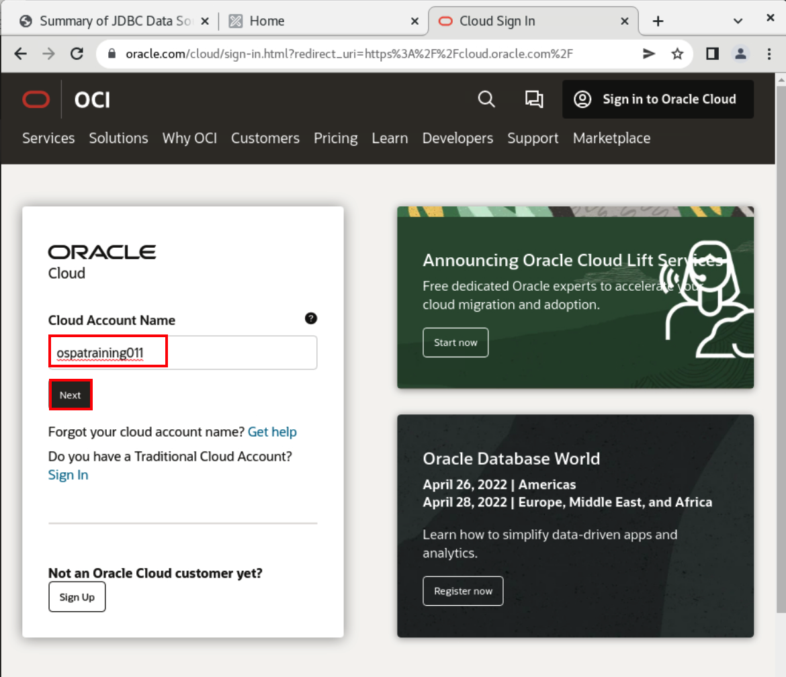

2. In Single Sign on page, Click *Continue*.
    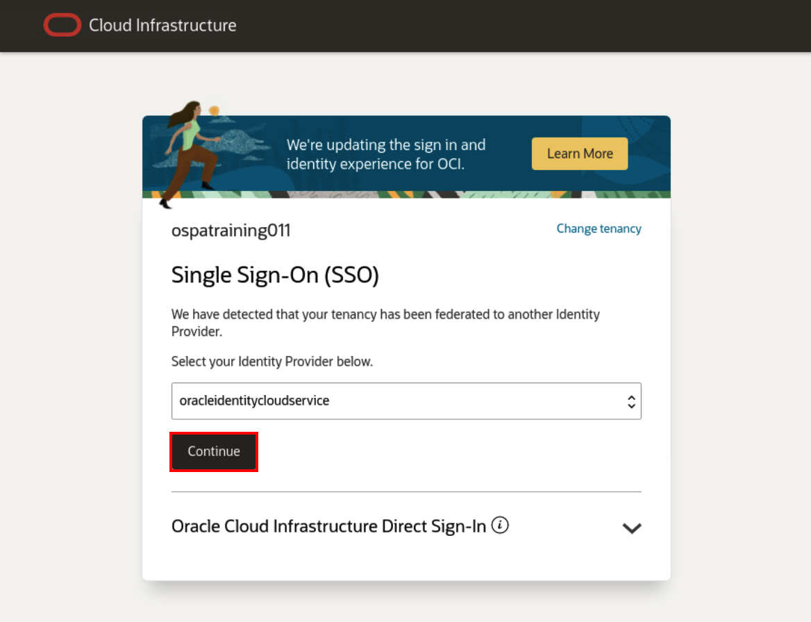

3. From text file, copy your luna username and password and paste here then click *Sign In*.
    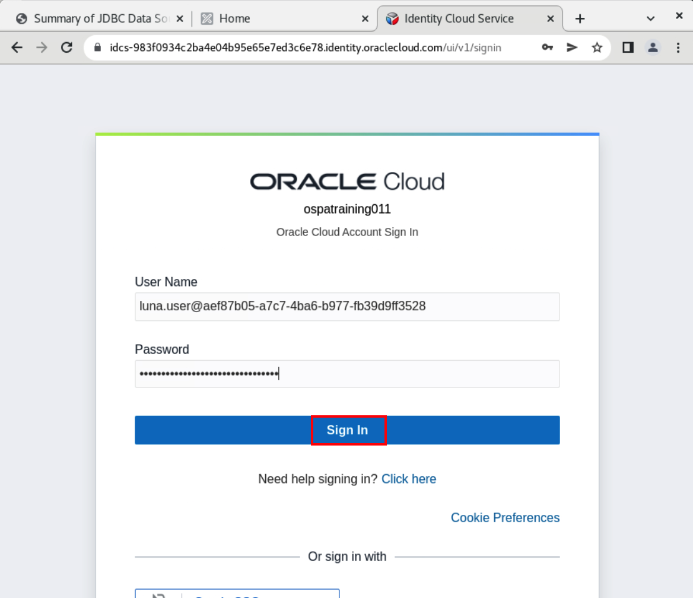

4. Click *User Icon* -> *User Settings*.    
    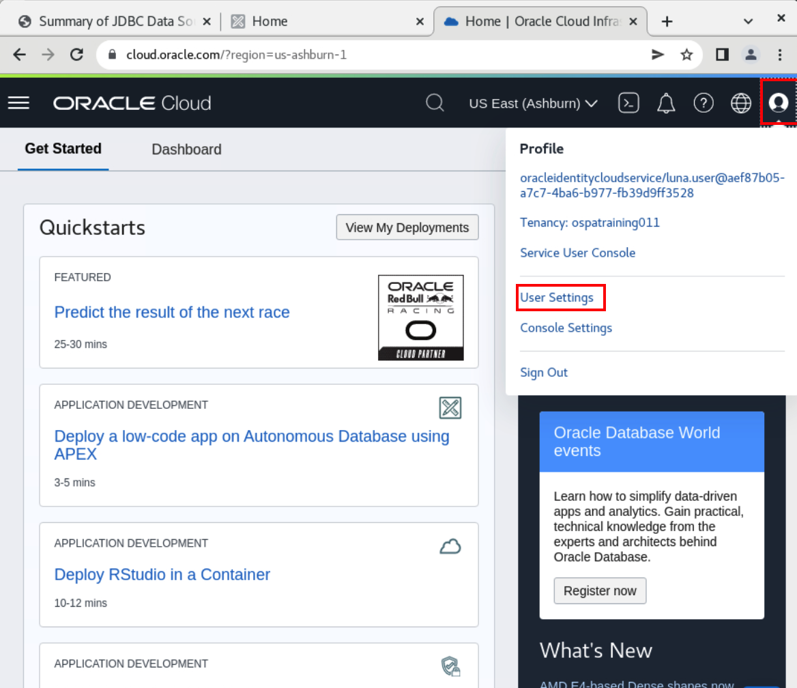

5. Scroll down, Click *API Keys* and then click *Add API Key*.
    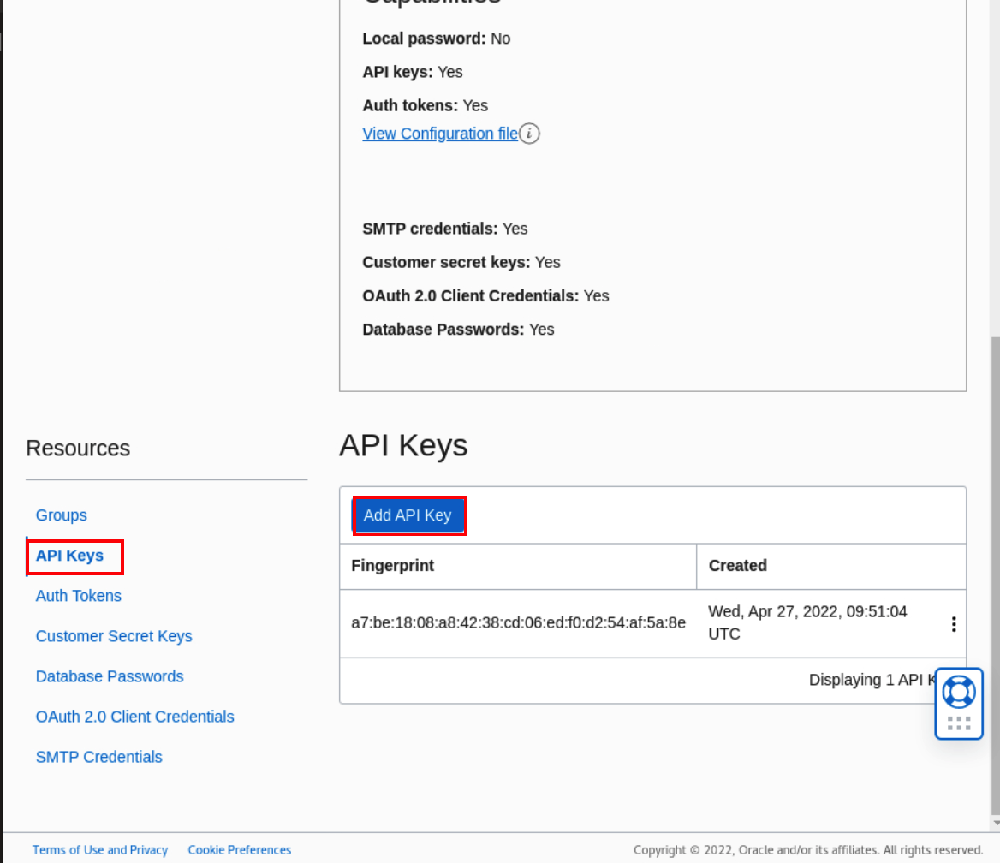

6. Select *Generate API Key Pair* and then Click *Download Private Key*, *Download Public Key* and *Add* as shown.
    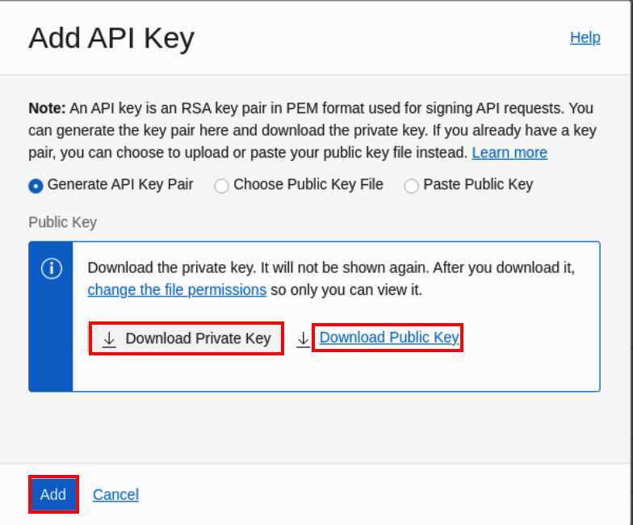

7. Click *Copy* and Paste the content of this in text file.
    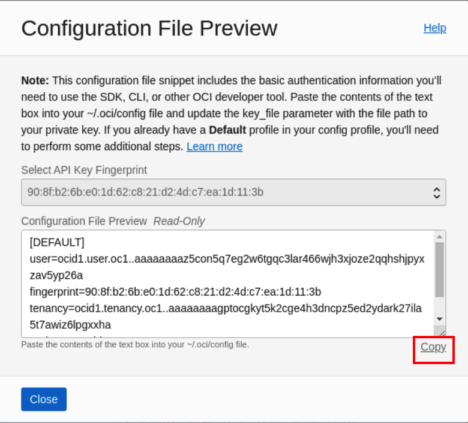

8. Find out the location of Private key and paste it in your text file. It should be something like `~/Downloads/oracle--`.

9. Click *Activities* and select Terminal, then click *File* -> *New Tab*. 
    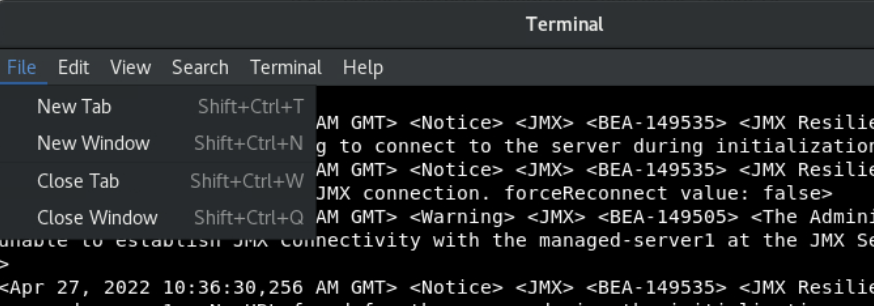

10. Copy and paste the following command in your new tab as shown.
    ```bash
    <copy>mkdir .oci
    vi ~/.oci/config</copy>
    ```
    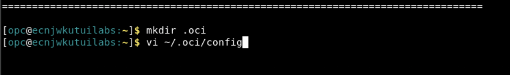

11. In your text file, fill the value of *key_file* with location of private key and then copy the content and paste it in *.oci/config* file as shown.
   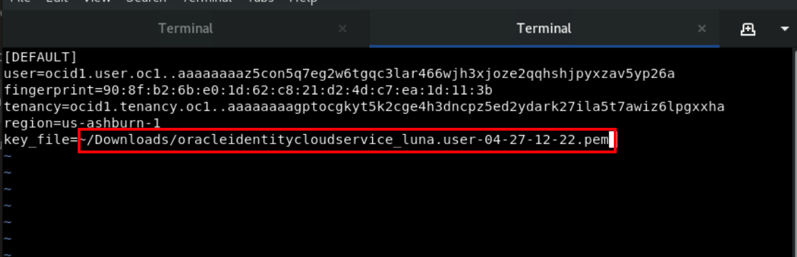

12. Copy and paste the following command to change the permission of *oci/config* and *private key* file

    ```bash
    <copy>chmod 600 .oci/config ~/Downloads/<your_private_key_name></copy>
    ```
    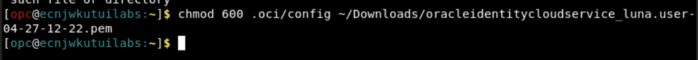

13. In Cloud console, Click *Hamburger menu* -> *Developer Services* -> *Kubernetes Clusters (OKE)*.
    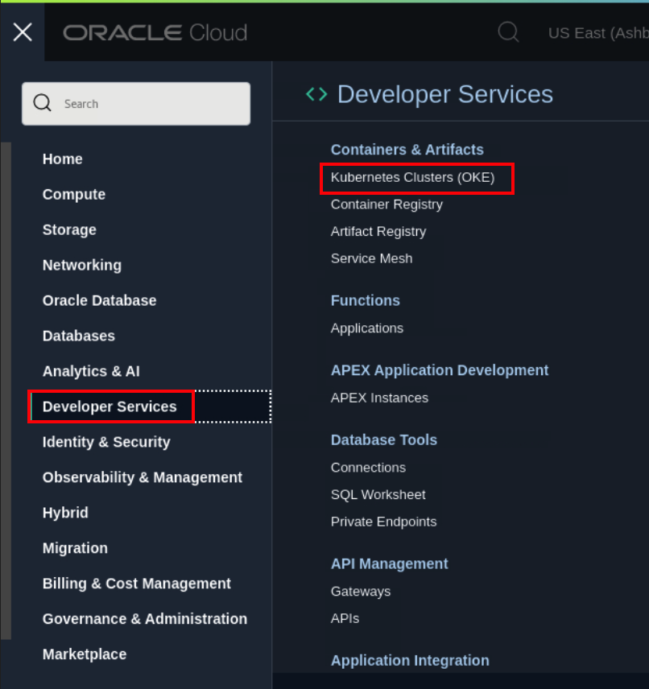

14. Select the correct compartment name and then click *cluster1*. 
    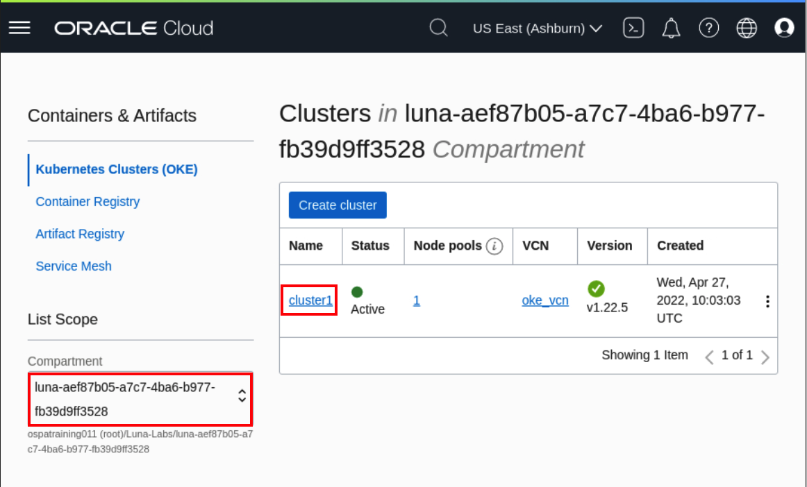

15. Click *Access Cluster*.
    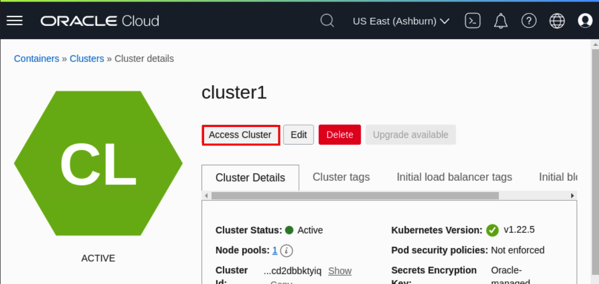

16. Select *Local Access* and Copy the *VCN-Native Public endpoint* as shown.
    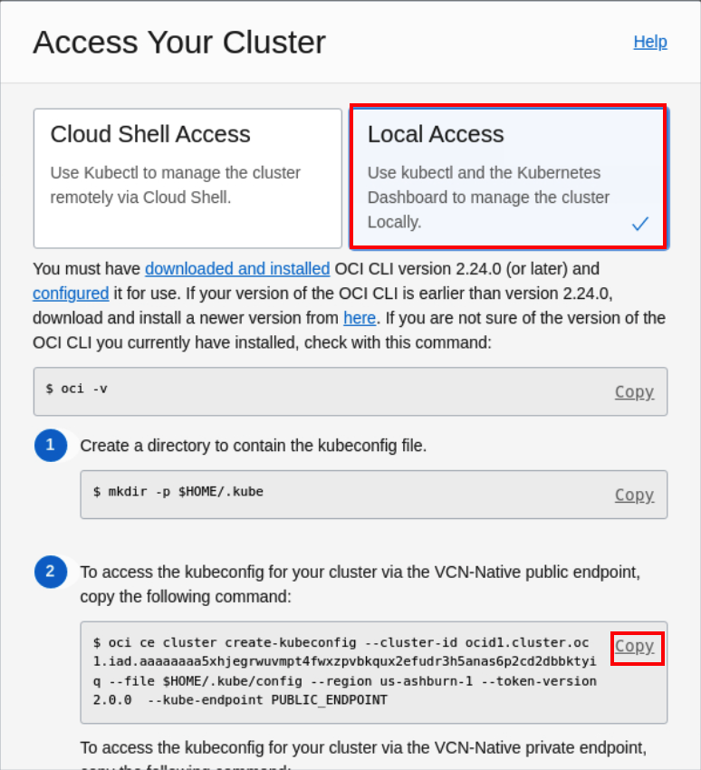

17. Paste this command in terminal as shown.
    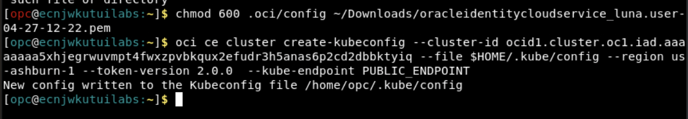

    > It creates the *.kube/config* file.

## Task 2: Verify Connectivity of WebLogic Kubernetes Toolkit UI to Oracle Kubernetes Cluster
In this task, we verify the connectivity to *Oracle Kubernetes Cluster(OKE)* from the `WebLogic Kubernetes Toolkit UI` application.

1. Go back to WebLogic Kubernetes Tool Kit UI, click  *Kubernetes* ->  *Client Configuration* and then click *Verify Connectivity*.
    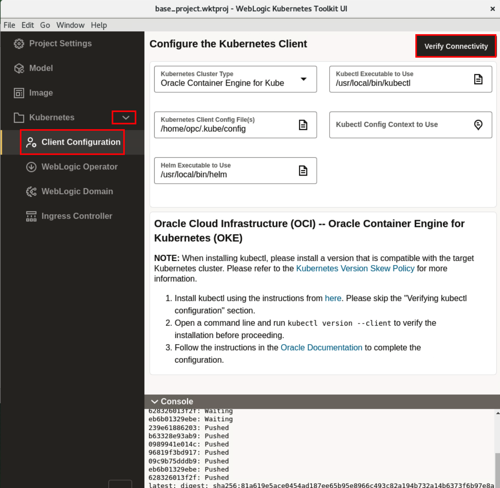

2. Once you see *Verify Kubernetes Client Connectivity Success* window, Click *Ok*.
    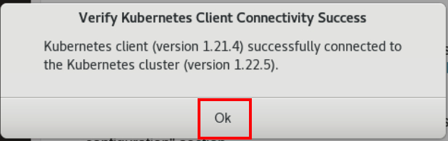

## Task 3: Install the WebLogic Kubernetes Operator to Oracle Kubernetes Cluster
This section provides support for installing the WebLogic Kubernetes Operator (the “operator”) in the target Kubernetes cluster. 

1. Click *WebLogic Operator*. Specify the following configuration details  and click *Install Operator*.

    **Kubernetes Namespace** - The Kubernetes namespace to which to install the operator. Leave the default value.<br>
    **Kubernetes Service Account** - The Kubernetes service account for the operator to use when making Kubernetes API requests. Leave the default value.<br>
    **Helm Release Name to Use for Operator Installation** - The Helm release name to use to identify this installation. Leave the default value.<br>

    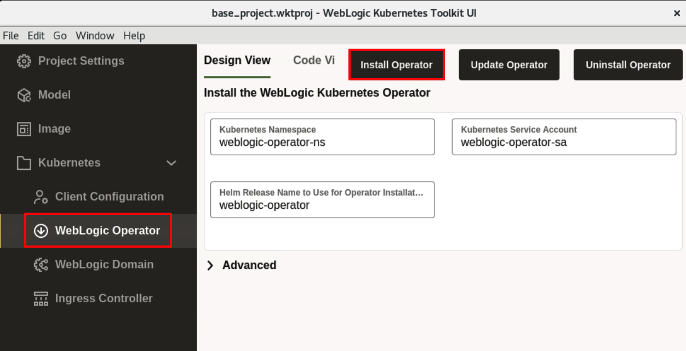 
    
2. Once you see *WebLogic Kubernetes Operator Installation Complete*, Click *Ok*.
    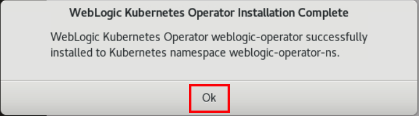

## Acknowledgements

* **Author** -  Ankit Pandey
* **Contributors** - Maciej Gruszka, Sid Joshi
* **Last Updated By/Date** - Kamryn Vinson, March 2022