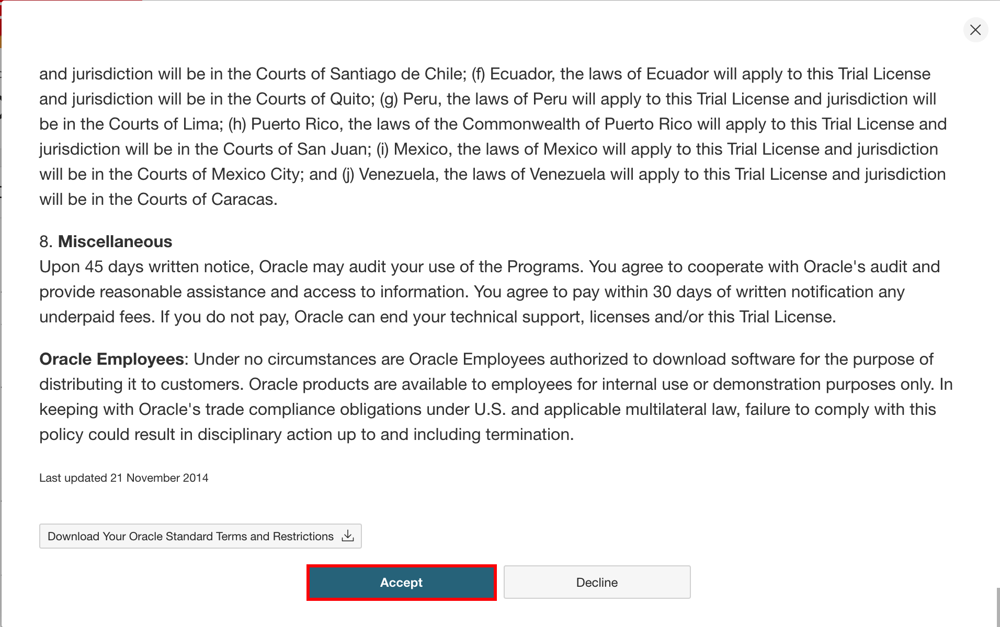

# Prepare the Environment

## Introduction

In this lab, you collect the information, creates the repository and accept the license for WebLogic server images.

Estimated time: 20 minutes


### Objectives

In this lab, you will:

* Collect data for cloud environment.
* Create a repository
* Accept the license for WebLogic server images
* Create a URL for noVNC remote desktop

### Prerequisites

This lab requires the following:

* You must have a text editor.
* Chrome or Firefox browser.

## Task 1: Collect the data

1. In Luna Desktop, Click *Luna Lab*.
  

2. In text editor, create a text file and copy the following field and paste it in text file:

    ```bash
    <copy>Luna Environment Details:

    User Name: 				
    Password: 				
    OCI Auth Token: 		
    OCI Region: 			
    Tenancy Name: 
    Compartment Name: 
    Region Endpoint:			
    Tenancy Namespace: 		
    Image Registry Username:  [TenancyNamespace/oracleidentitycloudservice/LunaUsername] 							
    Example: /oracleidentitycloudservice/
    Auxiliary Image Tag: 		[RegionEndpoint/TenancyNamespace/test-model-YourFirstName]
    Example: //test-model-</copy>
    ```
    

    > From Luna, you will take these values and paste it in this text file.

3. In *Luna Lab* tab, Copy the values for *Username*, *Password* and *OCI Auth Token* and paste it in text file.
    

4. In *Oracle Cloud* tab, Copy the values for *OCI Region*, *Tenancy Name* and *Compartment Name* and paste it in text file.
    
    

5. Click *Luna Lab* and then *OCI Console* as shown.
    

6. Enter the Username/Password and then click *Sign In*.
    

## Task 2: Create a repository inside Oracle Cloud Container Registry

1. In Cloud console, Click *Hamburger Menu* -> *Developer Services* -> *Container Registry*.
    

2. Select the correct compartment, and copy the *Namespace* to your text file. Click *Create repository*.
    
    > This is your tenancy namespace.

3. Enter *test-model-YourFirstName* as Repository name and select *Public* as access, then click *Create repository*.
    

    > Please replace *YourFirstName* with your firstname and make repository name specific.


## Task 3: Accept the license for WebLogic Server Images 

We will use WebLogic Server 12.2.1.3.0 image as our Primary Image. So, to get access to WebLogic Server Images, we accept the license agreement in Oracle Container Registry.

1. Copy and paste the link for the Oracle Container Registry [https://container-registry.oracle.com/](https://container-registry.oracle.com/) in browser and sign in. For this, you need an Oracle Account.
    
    
    > This is not your Luna username and password. 
    
2. Enter your *Oracle Account Credentials* in the Username and Password fields, and then click *Sign In*.
    

3. In the Home page of Oracle Container Registry, Search for *weblogic*.
    

4. Click *weblogic* as shown and select *English* as the language, then click *Continue*.
    
    

5. Click *Accept* to accept the license agreement.
    

## Task 4: Prepare the text file

1. To find out the endpoint for your Region, copy and paste this URL [https://docs.oracle.com/en-us/iaas/Content/Registry/Concepts/registryprerequisites.htm#Availab](https://docs.oracle.com/en-us/iaas/Content/Registry/Concepts/registryprerequisites.htm#Availab) in browser. In my case, it is *US East (Ashburn)* as the region name, thus its endpoint is *iad.ocir.io*. Find out your endpoint for your own *Region Name* and save it in your text file.
    

2. Now you have the values for *Tenancy namespace* and *Region Endpoint*, so create your own *Image Registry Username* and *Auxiliary Image Tag*.
    

    > Example are for your referency only. As in Luna, environment is temporary, so these data will not work.


## Task 5: Open noVNC remote desktop outside the Luna Environment.

1. In Cloud console, Click *Hamburger menu* -> *Compute* -> *Instances*.
    

2. Copy the *Public IP* for *weblogic* instance and paste it in text file.
    

3. Copy and paste the following URL and replace *XX.XX.XX.XX* with *Public IP* which you got in last step.
    ```bash
    <copy>http://XX.XX.XX.XX:6080/vnc.html?password=LiveLabs.Rocks_99&resize=scale&quality=9&autoconnect=true&reconnect=true</copy>
    ```
    
    > For better visibilty, please open the URL outside the Luna Environment.

4. In noVNC remote desktop, Click *Activities* and then click *Icon for Text editor* as shown.
    

5. Open the clipboard as shown, Copy the content of text file, which you prepared in last task and paste it in clipboard.
    

6. Paste the content in *Untitled Document 1* inside the text editor as shown below.
    

7. To open the terminal, Click *Activities* and then click *Icon for terminal* as shown.
    

8. Copy and paste the following command in terminal and run it.
    

    > This open a workshop document on left side and one browser window on right side. It also start the admin server in test domain.

9. Now you have both workshop document and remote desktop. So follow the document inside the remote desktop.
    
    
## Acknowledgements

* **Author** -  Ankit Pandey
* **Contributors** - Maciej Gruszka, Peter Nagy
* **Last Updated By/Date** - Ankit Pandey, April 2022
