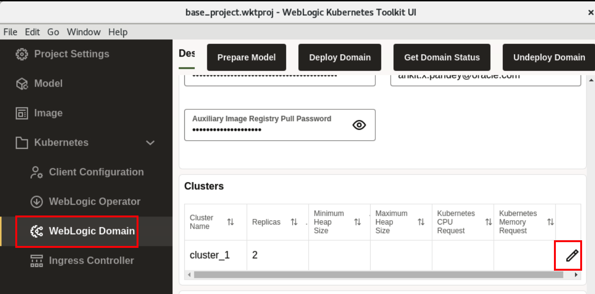
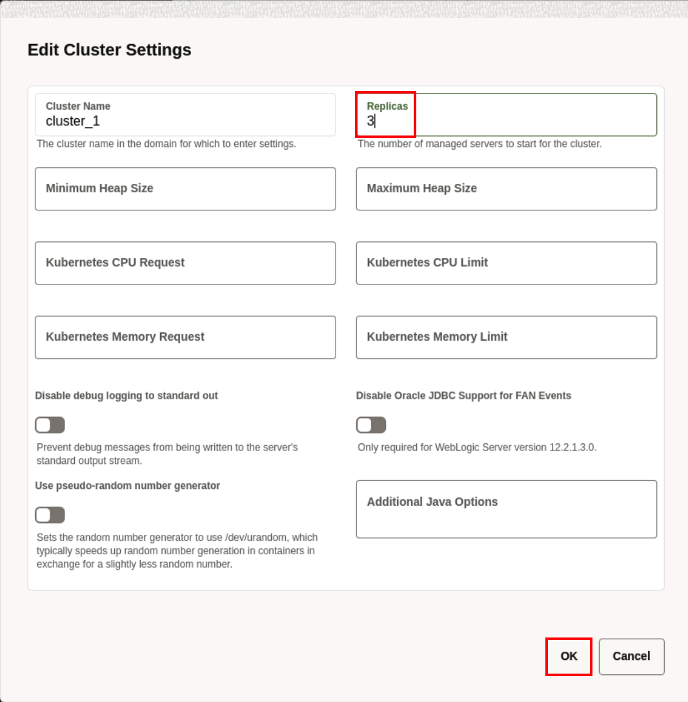
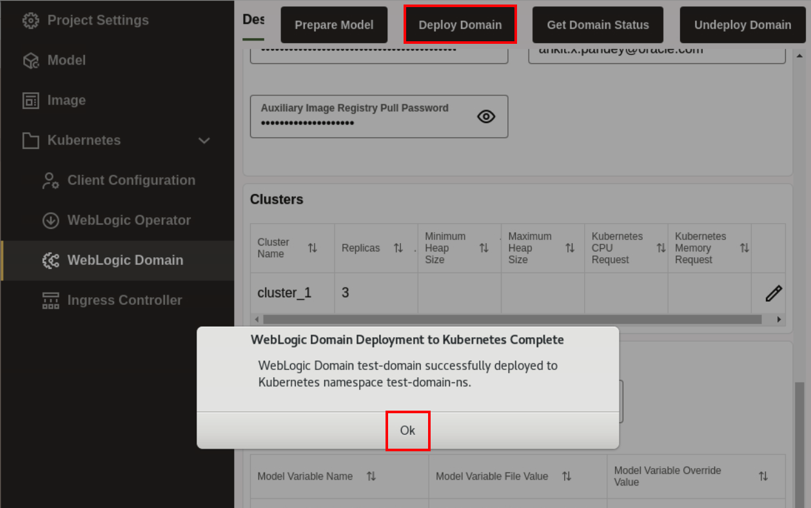
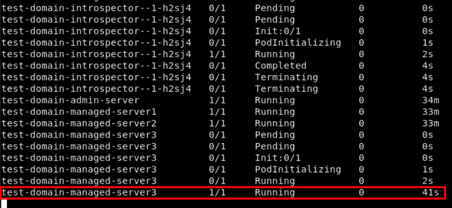

# Scale the WebLogic Cluster 

## Introduction

In this lab, we scale a WebLogic Cluster. Here, we modify the value to *3* and re-deploy the domain.

### Objectives

In this lab, you will:

* Scale a WebLogic Cluster.

## Task 1: Scaling a WebLogic Cluster using WebLogic Kubernetes Toolkit UI

In this task, you just need to modify the *Replica* value from 2 to 3 and re-deploy the domain again. 

1. Go back to WebLogic Kubernetes Toolkit UI,  Click *WebLogic Domain*. Go to *Clusters* section and click on *Edit* icon.  
    

2. Change the Replicas from *2* to *3*, and click *OK*. 
    

3. To Re-deploy the domain, click *Deploy Domain*. Once you see *WebLogic Domain Deployment to Kubernetes Complete* window, click *Ok*.
    

4. Go back to *Terminal* window, Click *Activities* and select the *Terminal* window. 

    
    > You can see, re-deployment of domain, starts the process of creating pod for test-domain-managed-server3 and in sometime, this pod gets into *Running* status.

## Acknowledgements

* **Author** -  Ankit Pandey
* **Contributors** - Maciej Gruszka, Sid Joshi
* **Last Updated By/Date** - Kamryn Vinson, March 2022